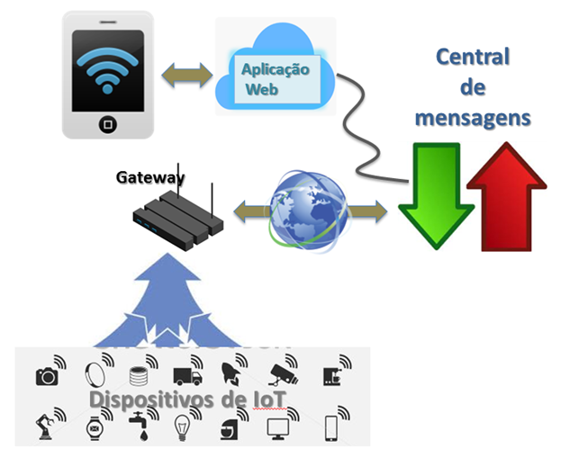

## NAC4 - Projeto de Internet das Coisas

- O objetivo do checkpoint é avaliar sua compreensão acerca do conteúdo ministrado pela disciplina. 

## Ideia geral

Construção de uma solução de IoT que abrange todas as pontas da comunicação entre usuário e dispositivos

A NAC consiste no desenvolvimento de uma solução simples mas completa que ilustra as partes mais importantes de uma arquitetura de IoT: os dispositivos e os usuários. A solução também não contempla as ferramentas de segurança que seriam necessárias ao implantar um sistema real.

## Entrega e Apresentação do projeto:

- Individual ou em Grupo (até 5 alunos)
- Entrega da documentação via github, apresentar o repositório ORGANIZADO do projeto com toda a doumento e instruções de como replicar o projeto. (em breve o formulario para preenchechimento)
- **A apresentação da NAC será presencial, e ocupará as aulas do dia 24/10/2022(4SIS) 26/10/2022(4SIA)**

Haverá tempo durante as aulas para tirar dúvidas quanto ao desenvolvimento do trabalho. 

## Rubrica

***(R1 - NOTA até 2 pontos)*** Programa em linguagem do Arduino que realize pelo menos:

 - A leitura de pelo menos dois sensores a cada **200ms**, disponibilizando as leituras na porta serial, no formato JSON {"<SENS1>":<VALOR1>, "<SENS2>":<VALOR2>}, onde <SENS1> e <SENS2> são os nomes dos sensores, e <VALOR1> e <VALOR2> são os valores lidos, respectivamente 

 - a execução de comandos em pelo menos dois atuadores, lendo esses comandos pela porta serial. Os comandos devem ser na forma {“<CMD>”:<VALOR>}, onde CMD é o nome do comando e VALOR é o parâmetro enviado. Por exemplo, se <CMD> for led, então <VALOR> pode ser “On” ou 255, por exemplo.

 - para mais sensores e atuadores siga as instruções acima.

***(R2 - NOTA até 2 pontos)*** Comunicação com o broker MQTT de sua escolha: de ser desenvolvido um programa Node-RED ou Arduino que conecte o dispositivo de IoT à central de mensagens (MQTT Broker) através dos seguintes tópicos:

 - Realize PUB sempre que for realizada a leitura dos sensores, convertendo e enviando a informação de cada sensor no formato JSON {"value": <VALOR>} ao tópico: 
 
fiap/iot/turma/<TT>/grupo/<NNN>/devtype/<TYPE>/devid/<ID>/sensor/<SENS>

onde:

    * <TT> corresponde à turma (4sia, 4sir ou 4sis)
    * <NNN> corresponde ao nome do grupo
    * <TYPE> corresponde ao tipo de dispositivo (arduino ou esp8266)
    * <ID> corresponde à identificação do dispositivo (pode ser o MAC Address do ESP8266, ou o número de série do Arduino, ou qualquer identificação que quiser)
    * <SENS> corresponde ao nome do sensor

 - Para cada sensor, faça a subscrição (SUB) ao seguinte tópico, que irá receber um JSON da forma {"value": <VALOR>} :

fiap/iot/turma/<TT>/grupo/<NNN>/devtype/<TYPE>/devid/<ID>/cmd/<CMD>

onde <CMD> corresponde ao nome do comando a ser executado. Ao receber o comando, ele deve ser convertido e enviado à placa para ser executado.

Este item pode ser realizado de duas formas:

    - No caso da placa de IoT ser um Arduino, o item 2 deve ser executado na forma de um Gateway programado em Node-RED, que se conecta ao Arduino através da porta serial.

    - No caso da placa de IoT ser um ESP8266 Node-MCU, este item deve constar da programação da placa (em linguagem Arduino), e não é necessário um gateway adicional.  

***(R3 - NOTA até 2 pontos)*** Aplicação Web desenvolvida em Node-RED que se conecte ao Broker MQTT e contenha uma API ReSTful com os seguintes endpoints 

- Recupera uma lista de IDs de dispositivos do tipo especificado, no formato JSON
[GET]http://<HOST>:<PORTA>/<PROJNAME>/fiap/iot/turma/<TT>/grupo/ <NNN>/devtype/<TYPE>/devid/all

- Recupera a lista dos sensores disponíveis para o dispositivo, no formato JSON
[GET]http://<HOST>:<PORTA>/<PROJNAME>/fiap/iot/turma/<TT>/grupo/<NNN>/devtype/<TYPE>/devid/<ID>/sensor/all

- Recupera o último valor lido no sensor, no formato JSON {"value": <VALOR>}
[GET]http://<HOST>:<PORTA>/<PROJNAME>/fiap/iot/turma/<TT>/grupo/<NNN>/devtype/<TYPE>/devid/<ID>/sensor/<SENS>

- Recupera a lista dos comandos disponíveis para o dispositivo, no formato JSON
[GET]http://<HOST>:<PORTA>/<PROJNAME>/fiap/iot/turma/<TT>/grupo/<NNN/devtype/<TYPE>/devid/<ID>/cmd/all

- Executa um comando, passando um argumento da forma {"value": <VALOR>} 
[POST]http://<HOST>:<PORTA>/<PROJNAME>/fiap/iot/turma/<TT>/grupo/<NNN>/devtype/<TYPE>/devid/<ID>/cmd/<CMD>

***(R4 - NOTA até 2 pontos)*** Dashboard no Node-RED cuja interface gráfica demonstre o funcionamento de todas os endpoints do exercício anterior, ou seja:

- Apresente controles que permitam enviar comandos para o Arduino ou ESP8266 Node-MCU
- Apresente indicadores que permitam saber o valor dos sensores do Arduino ou ESP8266 Node-MCU

***(R4 - NOTA até 2 pontos)*** Desenvolvimento de alguma feature especial de pesquisa extra para o projeto, podendo ser:

- Uso de comunicação Bluetooth entre o Arduino e o Gateway Node-RED
- Uso do ESP8266 Node-MCU
- Uso da Raspberry como Gateway Node-RED
- Uso de um dos sensores especiais: validar com o professor.
- Protótipo funcional com parte mecânica usando a infraestrutra do laboratório MakerLab (corte a laser, impressora 3D entre outros...)

