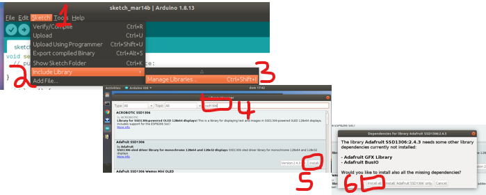
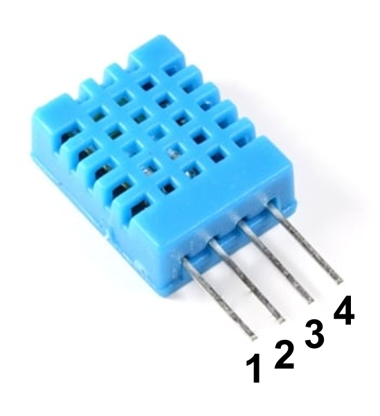
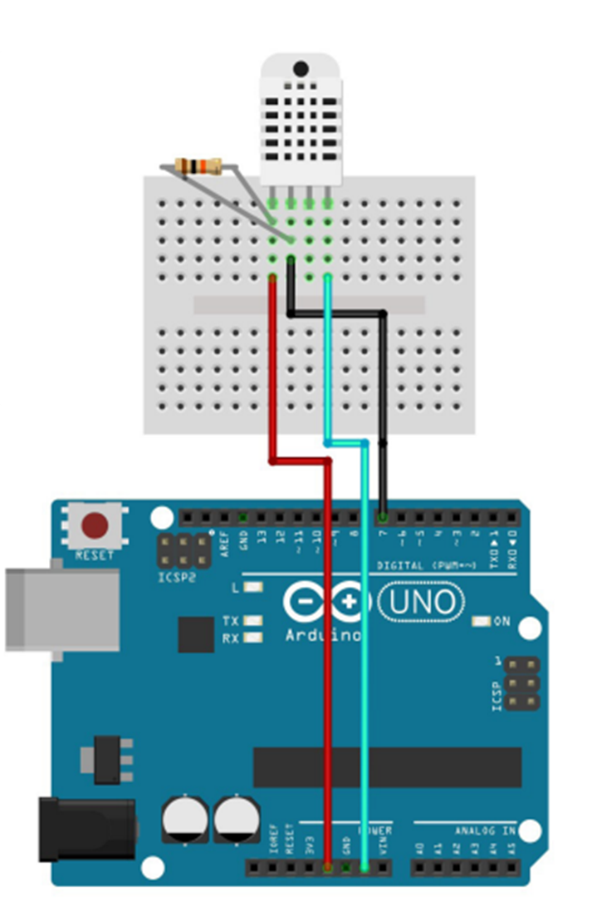
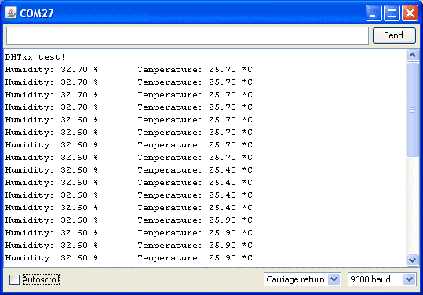
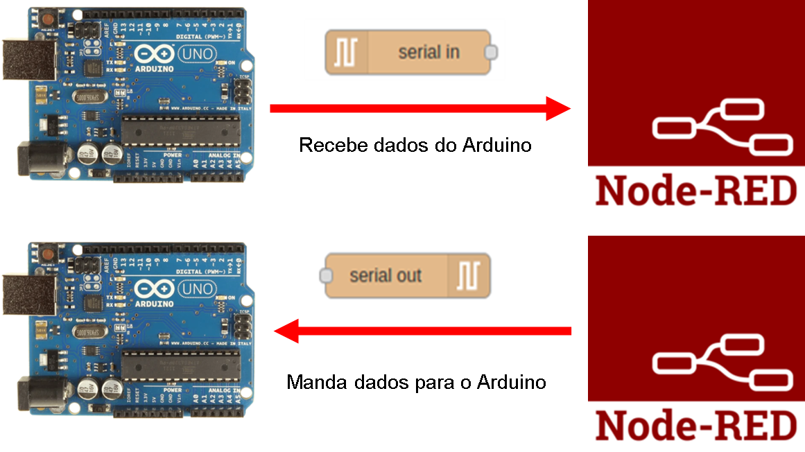
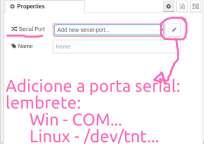
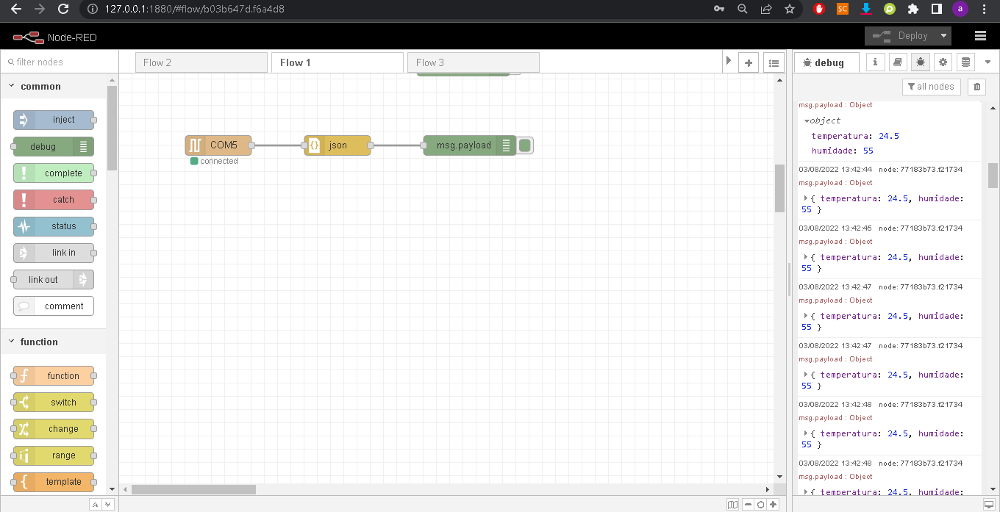
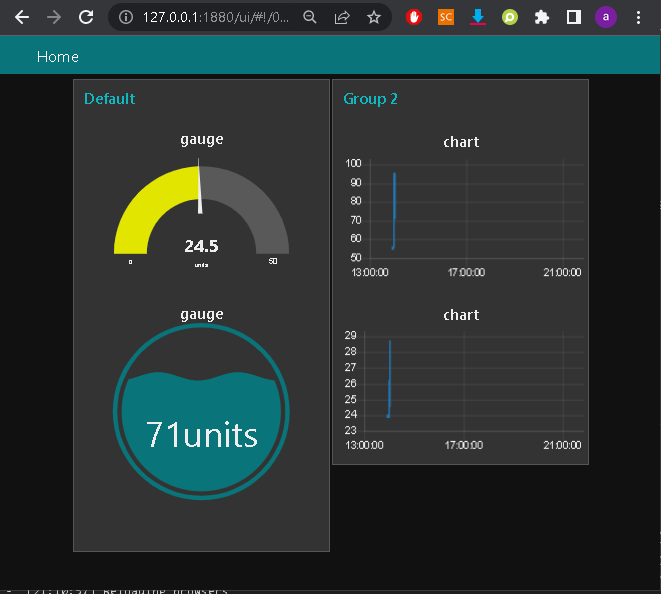

## O que esse vamos ver neste lab?

- Instalação e uso de bibliotecas externas para arduino
 
    - Arduino JSON
    - Sensor de temperatura e umidade DTH11

- Comunicação serial entre Arduino e o Node-RED

    - Como mandar dados do arduino para o node-RED no formato JSON

- Como desenvolver um sistema supervisório para monitoramento de temperatura e umidade

## Instalação e uso de bibliotecas externas para arduino

Normalmente os criadores das bibliotecas descrevem o passo-a-passo para utilizar as bibliotecas criadas, mas de forma geral podemos instalar uma biblioteca externa de duas formas: 

- Por Download: 
    - Fazer o download do arquivo .zip da biblioteca 
    - Descompactar o arquivo dentro da pasta ~/Arduino/libraries/
    - Pronto! Podemos usar em nosso projeto.
    - De forma geral é isso, eventualmente o criador da biblioteca irá orientar eventuais etapas adicionais. 

- Pelo gerenciador de bibliotecas:
    - abra o Arduino IDE
    - acesse: Sketch ==> Include Library ==> Manage Libraries… 
    - Digite na busca o nome da biblioteca
    - Encontre a opção desejada e clique em instalar
    - Pronto! Podemos usar em nosso projeto.
    - Algumas libs dependem de outras de outras libs, nesse caso é necessário instalar todas as libs.

??? note "Imagem passo-a-passo"
    


> DICA: Explore a documentação e os exemplos da biblioteca instalada.   


## ArduinoJson

A biblioteca ArduinoJSON é escrita em C++ para realizar a comunicação de dados no formato JSON (JavaScript Object Notation) com aplicações para IoT. 
Pra quem conhece Python a estrutura é muito parecida com a de dicionários:

> {"Key1":"Value1", "Key2":"Value2", "Key3":"Value3","....":."...."}  

Documentação oficial em: [arduinoJSON](https://arduinojson.org/)

??? note "Desafio"
    Faça a instalação da biblioteca arduinoJSON direto pelo ArduinoIDE, no campo de busca digite ``ArduinoJson`` e instale a biblioteca. Para mais detalhes de como realizar a instalação acesse [aqui a documentação oficial de instalação](https://arduinojson.org/v6/doc/installation/)
 
## DTH11

O DTH11 é um sensor digital de temperatura e umidade muito utilizado em diversas aplicações. Para facilitar o trabalho utilizamos uma biblioteca para realizar as leituras de temperatura e umidade. 




| Pino |           Descrição              |
|:----:|:--------------------------------:|
|    1 |    Alimentação, VCC, 3,5V ~ 5,5V |
|    2 |    DATA, transmissão de dados    |
|    3 |    NC, Não Conectado             |
|    4 |    Alimentação, GND, 0v          |

> Cuidado para não inverter os pinos de alimentação. 


??? note "Desafio"
    Faça a instalação da biblioteca DTH11 fazendo o Download zip do repositório através [link](https://https://github.com/adafruit/DHT-sensor-library). Após o download descompacte o arquivo .zip, renomeie para ``DTH`` e mova-o para a pasta ~/Arduino/Libraries/

## Testando o sensor DTH11 

Para testar o funcionamento do sensor vamos executar 2 etapas: Hardware e Software.

### O hardware de teste

Monte o circuito da imagem abaixo e não esqueça de conectar o resistor 
 


 ??? note "Desafio"
    De acordo com o circuito qual o pino do arduino é utilizado para realizar comunicação digital com o sensor DTH11?

### O código de teste 

Crie um novo projeto no ArduinoIDE e tilize o código de teste abaixo:
Este código foi adaptado do site [filipeflop](https://www.filipeflop.com/blog/monitorando-temperatura-e-umidade-com-o-sensor-dht11/)

```c
/*
Código para teste do sensor DTH11 

*/
#include "DHT.h"
#define DHTPIN  7  //define o pino usado no arduino
#define DHTTYPE DHT11
DHT dht(DHTPIN, DHTTYPE); //declara a objeto da classe
 
void setup() 
{
  Serial.begin(9600);
  Serial.println("DHTxx test!");
  dht.begin();
}
 
void loop() 
{
  float h = dht.readHumidity();  // faz leitura da umidade
  float t = dht.readTemperature();  // faz leitura da temperatura

  // testa se retorno é valido, caso contrário algo está errado.
  if (isnan(t) || isnan(h)) 
  {
    Serial.println("Falha na leitura do sensor DHT");
  } 
  else
  {
    Serial.print("Umidade: ");
    Serial.print(h);
    Serial.print(" %t");
    Serial.print("Temperatura: ");
    Serial.print(t);
    Serial.println(" *C");
  }
}
```
### O teste 

Após montar o circuito e escrever o código, carregue o código no arduino e abra o Monitor Serial para visualizar o funcionamento com mas medidas da temperatura e umidade, o resultado esperado deve ser igual da imagem abaixo.
 


Parabéns!! Primeira parte concluida, vamos em frente... 


## Usando a biblioteca Arduino Json

Vamos altera nosso código para enviar as informações do sensor DTH11 em formato JSON, observe o código abaixo com as alterações:

Uma etapa importante é definir a variavel TAMANHO que serve como buffer em bytes para alocar o JSON que vamos trabalhar. Para isso podemos utilizar o ``ArduinoJson Assistant`` [neste link](https://arduinojson.org/v6/assistant/#/step1), siga o passo-a-passo da ferramenta para descobrir o valor minimo que devemos utilizar. 

??? note "Desafio"
    Utilizando o ``ArduinoJson Assistant`` qual o valor recomendado para o json do exemplo abaixo?

    ```python
    {
    "Key1":10.10258,
    "Key2":50.28546
    }    
    ```
    

```c
/*
Código exemplo demonstrando o funcionamento do Sensor DTH11 enviando 
informações via serial no formato JSON para o servidor node-Red que recebe e transmite via protocolo MQTT 

*/

/////Json
#include <ArduinoJson.h>
const int TAMANHO = 200;  //define o tamanho do buffer para o json

///// Sensor DTH
#include "DHT.h"
#define DHTPIN  7  //define o pino usado no arduino
#define DHTTYPE DHT11
DHT dht(DHTPIN, DHTTYPE); //declara a objeto da classe

////// Outras declarações
#define led 13 //define led conectado no pino 13
 
void setup() 
{
  //inicialia c sensor
  dht.begin();
  
  //inicializa comunicação serial
  Serial.begin(9600);

  //configura pinos de saida do arduinos
  pinMode(led, OUTPUT);
}
 
void loop() 
{
  StaticJsonDocument<TAMANHO> json; //Aloca buffer para objeto json

  // Faz a leitura da temperatura  
  float temp = dht.readTemperature();
  // faz a leitura da humidade
  float hum = dht.readHumidity();

  //formato de escrita do json
  json["temperatura"] = temp;
  json["humidade"] = hum;

  serializeJson(json, Serial);
  Serial.println();

  //delay
  delay(500);
}

```

Etapa 2 concluida! Agora o nosso programa envia dados no formato Json, facilitando a integração com outros sistemas incluindo o Node-RED.

## Comunicação serial com node-RED

Vamos usar o node ``serialport`` para realizar a comunicação serial entre o node-red e o arduino conectado na porta que conectado na porta USB , por padrão esse não vem instalado. Faça a instalação do node ``node-red-node-serialport``.



No node-RED monte o flow


Agora configure o node da serial da seguinte forma: 
    
    - Serial Port: com o nome da porta COM que está alocada para o arduino
    - baud rate: para 9600. 



Faça o deplay e se tudo estiver correto, no debug vai aparecer as mensagens recebidas pelo arduino.


 
## Desenvolvimento de um sistema supervisório para monitoramento de temperatura e umidade

Para o desenvolvimento do sistema de supervisório ficar completo basta adaptar o fluxo que temos no node-RED para receber os tópicos de temperatura e umidade separados e enviar para o dashboard.


??? note "Desafio"
    Faça as adaptações necessárias para exibir os valores de temperatura e umidade em 2 gauge e 2 chart como na imagem abaixo:
    


??? note "Desafio TOP"
    Baseado na solução do desafio anterior, altere o fluxo para enviar os dados do node-RED via protocolo MQTT. Em um segundo computador crie um fluxo no node-RED que recebe os topicos enviados.


## Controlando o arduino pelo node-RED

Chegou a hora de fazer o caminho de volta, ja mandamos dados para o node-RED, agora é vez de receber dados do node-RED. 

??? note "Desafio Final"
    Adicione um ``switch`` no dashboard e configure para enviar a string “liga” e “desliga” pela serial, para controlar um LED do arduino.
    DICA: Veja o exemplo ``Serial-JSON - RX`` na aba de exemplos aqui do site.
