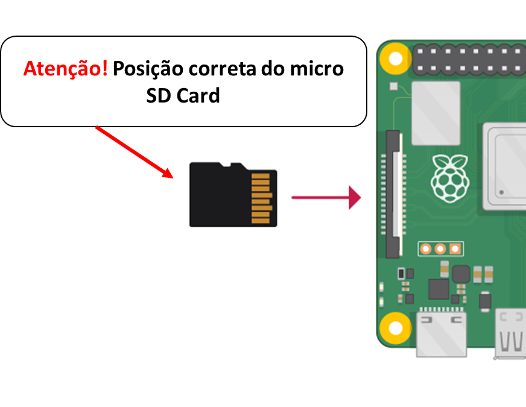

Até este momento do nosso curso, desenvolvemos pequenos projetos envolvendo sensores/atuadores e o nosso hardware foi o Arduino UNO além disso realizamos diversas integrações com Python e Node-Red.
 
Neste laboratório vamos começar nossa jornada de computação embarcada com aplicações voltadas paara a Internet das Coisas com o hardware ``Raspberry PI``. 
Nesta etapa vamos ver dentre outras coisas: o que é a Respberry Pi, Sistema Operacional Linux, como dar boot na placa Raspberry PI, como configurar e utilizar os GPIO - Pinos de Entrada/Saida, como realizar integração com Arduino, Node-Red e muito mais...

## O que vamos ver neste lab?

- Raspberry PI: o que é? Qual a diferença para o Arduino? 
- Raspberry Pi: Getting Started 
    - Overview - Conhecendo o hardware
    - Flash SD Card - Como dar boot do Sistema Operacional na Raspberry PI
    - Modos de uso - GUI x Headless
        - Headless - Configurando acesso SSH e rede Wifi.
        - Headless - VNC Viewer
        - GUI - Modo Desktop  
    - Controlando os GPIO - Blink LED.
        - Controle por CLI
        - Shell Script
        - ...

## Raspberry PI

Antes de falar da Raspberry PI, vamos lembrar que o Arduino UNO, que usamos, possui um ``microcontrolador`` de 8-bit [link do datasheet](https://ww1.microchip.com/downloads/en/DeviceDoc/Atmel-7810-Automotive-Microcontrollers-ATmega328P_Datasheet.pdf). Sua arquitetura RISC é simples e cobre bem os requisitos mínimos de um sistema embarcado. Contudo, não é possivel rodar um sistema operacional completo, o que pode limitar algumas possibiildades de sistemas mais complexos.

Para rodar um Sistema Operacional completo precissamos de um ``processador`` como o processador Intel I3, I5, I7, Celeron e muitos outros [(link do datasheet de um Intel I7)](https://www.intel.com/content/dam/www/public/us/en/documents/datasheets/core-i7-900-ee-and-desktop-processor-series-datasheet-vol-1.pdf) que usamos em nossos notebooks e desktops por exemplo. Como substituto de um notebook ou desktop podemos utilizar em algumas aplicações de computação embarcada um ``SBC``. 

Os computadores de placa única (SBC) são computadores (combinação de um processador, memória, suporte de rede, entrada e saída e outros...) em uma placa só, com a vantagem de ser de baixo custo e possuir pequenas dimensões compar
ado com um computador tradicional.

É neste ponto que vamos começar a falar da ``Raspberry PI`` que é a mais famosa e mais conhecida SBC que roda Sistema Operacional Embarcado (Linux) ou seja, com ela é possivel desenvolver e implementar uma infinidade de projetos. 

A Raspberry Pi foi lançada em 2012, sendo uma classe de pequenos computadores portáteis de baixíssimo custo, baseado nos processadores multimídia de arquitetura ARM da Broadcom, o mesmo que utilizados para celulares. O projeto foi um sucesso, vem crescendo e se atualizando, hoje temos diversos modelos para diversas aplicações diferentes como a Raspberry PI 3, 4, Zero e outros.

> [link da documentação oficial](https://www.raspberrypi.org/)

> [Link para conhecer outros modelos de SBC](https://all3dp.com/pt/1/single-board-computer-computadores-placa-unica-alternativas-raspberry-pi/)

Agora que já entendemos um pouco o que é Raspberry PI, vamos aprender a usar....

## Raspbeery PI - Getting Started

### Overview

Existem varios modelos de Raspberry PI, em nosso curso vamos utilizar a [``Raspberry PI 3 Model B+``](https://www.raspberrypi.com/products/raspberry-pi-3-model-b-plus/). 


> Para complementar:
>
> - Fonte de Alimentação: 5V @ >2A
>
> - Cartão SD Card: micro SD Card >8GB Classe 10 ou superior

### Sistema Operacional

Podemos utilizar diversas distribuções na RBI, dentre elas as mais comuns são:

- Raspbian - SO de uso geral 
- Ubuntu - SO de uso geral
- RetroPie - Emulador de video game
- OSMC - Media Center 
- Home Assistent - Automação Residêncial
- E muitos outross...

    
### Flash SD Card

O SO (Sistema Operacional) da RPI fica armazenado no ``micro SD Card`` que deve ser de pelo menos 8GB Classe 10 ou superior, existem diversas formas de realizar a gravação do SO, para isso se prepare pois chegou a hora de por a mão na massa. 

As outras versões do SO podem ser encontras [no link https://www.raspberrypi.com/software/operating-systems/](https://www.raspberrypi.com/software/operating-systems/). Em nosso curso vamos utlizar o ``Raspberry Pi OS (legacy)`` baseado na Distribuição Debian 10 (Buster). 


> Pra facilitar, o link para [downlod já está aqui](https://downloads.raspberrypi.org/raspios_oldstable_armhf/images/raspios_oldstable_armhf-2022-04-07/2022-04-04-raspios-buster-armhf.img.xz)


Para gravar o SD Card podemos utilizar algumas opções o mais simples é o ``Balena Etcher`` que roda em diversas plataformas.

> Para facilitar, o link para [download do balena Etcher https://www.balena.io/etcher/](https://www.balena.io/etcher/) 

!!! exercise
    Agora você deve:

        - Remova o SD Card da RPI e conecte no adaptador USB
        - Download do RPI OS 
        - Download do Balena Etcher
        - Abrir o Balena Etcher e siguir os passos para gravar o SD Card
        - Após a gravação remova SD Card e conecte no computador novamente
        - Se tudo deu certo:
            -  vão aparecer duas particições referentes, sendo uma delas chamada "boot"
            -  Caso contrario, alguma coisa deu errada, formate o SD Card em FAT32 e grave novamente. 
        

### Modo de uso - Interface Gráfica 

> **não é desta forma que vamos usar a Raspberry PI em nosso curso** 

Para utilizar a Raspberry como um computador normal é muito simples basta conectar na Raspberry PI: O SD Card gravado, um monitor HDMI, um teclado e um mouse. Com tudo conectado corretamente conecte a fonte de alimentação 5V, o sistema operacional irá inicializar e você pode usar :) .  




### Modo de uso - Headless

Vamos utilizar o Rasbperry PI no modo ``Headless``, ou seja, sem conectar monitor, teclado e mouse. Para utilizar este modo é necessário realizar algumas configurações no micro SD Card antes de dar boot na Raspberry PI.

#### Habilitar SSH

Para habilitar o SSH é necessário criar um arquivo vazio (sem extensão) chamado ssh dentro da pasta boot. 

!!! exercise
    Agora você deve:

        - Conecte o micro SD Card no adaptador USB
        - Acesse a partição boot 
        - crie um arquivo chamado ssh
        - este arquivo não possui extensão 


O resultado esperado é o da imagem abaixo:


#### Configuração de Rede Wi-fi

A configuração de rede do Wi-fi é feita através da configuração de um arquivo chamado wpa_supplicant.conf que deve ser criado dentro da pasta boot.

!!! exercise
    Agora você deve:

        - Conecte o micro SD Card no adaptador USB
        - Acesse a partição boot 
        - crie um arquivo chamado wpa_supplicant.conf
        - abra o arquivo com editor de texto (bloco de notas ou vscode)
        - configure o arquivo da mesma forma que o texto abaixo 

> Neste ponto é importe ter uma rede wifi para se conecetar, para uma rede personal use a configuração abaixo: 
> Esta configuração é a mais indicada e segura para ser usada em aula, para isso rotei a internet de seu celular.

```shell

country=BR
ctrl_interface=DIR=/var/run/wpa_supplicant GROUP=netdev
update_config=1
  
network={
        scan_ssid=1
        ssid="NOME_DA_REDE"
        psk="SENHA_DA_REDE"
}

```
> A rede da FIAP requer autenticação enterprise, ``não recomendo`` pois seu usuário e senha ficará salvo na raspberry pi e qualquer pessoa mal intencionada pode se utiizar desta vulnerabilidade.

```shell

# Connect to a WPA2 Enterprise network with wpa_supplicant with this .conf file.
# I used this to connect to my university's wireless network on Arch linux.
# Here's the command I used:
#
#   wpa_supplicant -i wlan0 -c ./wpa_supplicant.conf
# 

network={
  ssid="YOUR_SSID"
  scan_ssid=1
  key_mgmt=WPA-EAP
  identity="YOUR_USERNAME"
  password="YOUR_PASSWORD"
  eap=PEAP
  phase1="peaplabel=0"
  phase2="auth=MSCHAPV2"
}

```

Configuração finalizada! Agora vamos ligar! 

#### Boot Raspberry PI

Para ter acesso SSH ao raspberry PI vamos utilizar o o software ``PuTTy``.

> Para facilitar, o link para [download do PuTY https://www.putty.org/](https://www.putty.org/)

Agora com tudo configurado e instalado chegou a hora de ligar e testar.


!!! exercise
    Agora você deve:

        - Conecte o micro SD Card na Raspberry PI
        - Mantenha sua rede wifi ligada
        - Ligue o raspberry na Fonte de alimentação
        - Aguarde alguns segundos e vefifique o ip que foi atribuido ao Raspberry PI
        - abra o puTTY e digite o ip da Raspberry PI
        - Se tudo estiver correto, um terminal irá abrir e vai solicitar login e senha

> Por padrão, o login e senha da raspberry pi será:
>
> login: pi
>
> senha: raspberry
        
Finalizado! Agora estamos com nosso raspberry conectado e funcionando. 
