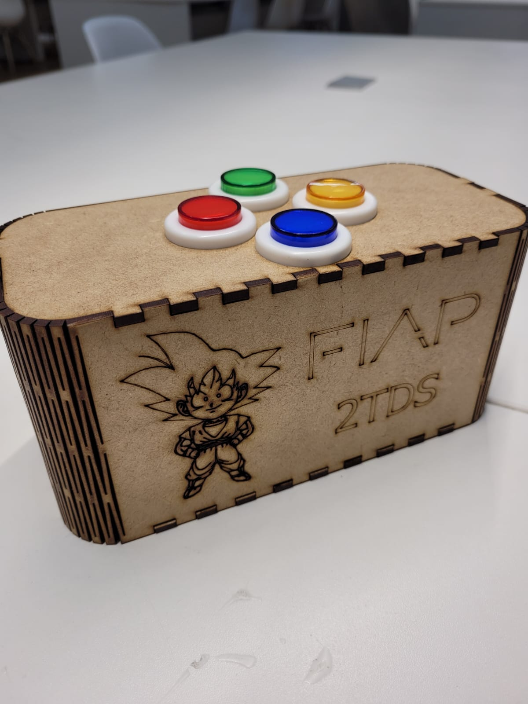

# CHECKPOINT3

- O objetivo do checkpoint é avaliar sua compreensão acerca do conteúdo ministrado pela disciplina. 

>  Use como base o código de exemplo do jogo da memória disponível neste repositório.
>   - https://www.github.com/arnaldojr/IoT
>   - link para download: [jogo da memória](jogomemoria/jogomemoria.ino)

Você vai precisar:

- ▶️ Arduino UNO
- ▶️ LEDs
- ▶️ Botões
- ▶️ Buzzer
- ▶️ Alguns resistores, jumpers e protoboard

### Ideia geral

Neste checkpoint vocês vão desenvolver um protótipo de um jogo da memória genius para arduino, que em linhas gerais irá possuir as seguintes interfaces:

- 4 ou mais LEDS de cores diferentes
- 4 ou mais Botões 
- Buzzer
- Interface de comunicação serial 

A seguir iremos detalhar um pouco mais como deve ser feito o protótipo e o que estará sendo avaliado.

## Genius arduino

O funcionamento do jogo é similar com qualquer outro jogo da memória, o jogador primeiramente da start no game. Os LEDs piscam de forma aleatória um por vez, em seguida o jogador pressiona os botões na sequência correspondente às cores dos LEDs. Se a sequência estiver correta, o jogador passa para o próximo nível de dificuldade, se errar é game over.   

A seguir detalhes do funcionamento:

Requisitos funcionais básicos:

- **LEDs:** Implemente o jogo com 4 LEDS de cores diferentes.
- **BOTÕES:** Implemente o jogo com 4 BOTÕES, no seu código cada botão corresponde a uma cor de LED.
- **BUZZER:** Implemente BUZZER para emitir uma frequência para cada cor de LED, o Buzzer deve tocar na sequência aleatória e no pressionar das teclas.

Requisitos funcionais avançados:

- **Comunicação (monitor serial):** Implementa comunicação serial, o usuário pode jogar com os botões e/ou a interface serial (monitor serial arduino).
- **Comunicação Python:** Implementa comunicação serial, um script python recebe via serial a informação da cor LED e exibe e exibe para o jogador o nome da cor.
- **Comunicação comando de voz:** O script em python se comunica com o arduino recebendo a informação da cor e emite por comando de voz do computador a cor que acendeu.

A rubrica segue o detalhamento: 

| Nota | Itens                                                                           |
|------|---------------------------------------------------------------------------------|
| 6    | Cumpre requisitos funcionais básicos                                            |
| 7    | Cumpre requisitos funcionais básicos e comunicação serial (monitor serial)      |
| 8    | Cumpre requisitos funcionais básicos e comunicação python                       |
| 9    | Cumpre requisitos funcionais básicos e Comunicação por comando de voz           |
| 10   | Cumpre requisitos funcionais básicos ao menos 1 requisito avançado e apresenta o protótipo funcional em um case personalizado  |

Como fazer uma case personalizado:

- **Case:** No site [https://www.festi.info/boxes.py/](https://www.festi.info/boxes.py/) é bem simples elaborar um case personalizado para o seu protótipo, tudo online e gratis, como o da imagem abaixo.

> - **Alguns links de videos para te ajudar a desenvolver seu case:** 
>    - [Manual do Mundo](https://www.youtube.com/watch?v=BwU0hSmWYdA&ab_channel=ManualdoMundo)
>    - [Angelo Conti](https://www.youtube.com/watch?v=4cI-WXnPCzU&ab_channel=AngeloConti)
>    - [Maker Space 307](https://www.youtube.com/watch?v=1wWAfO6k0t4&t=391s&ab_channel=MakerSpace307)
>    - [Smoke & Mirrors](https://www.youtube.com/watch?v=8q7HpDpOJ1U)
 
- **Especificação da máquina CNC para fabricação:** Escolha a espessura de 3mm para o MDF. 