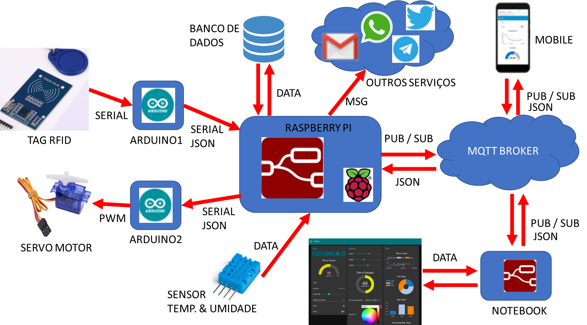
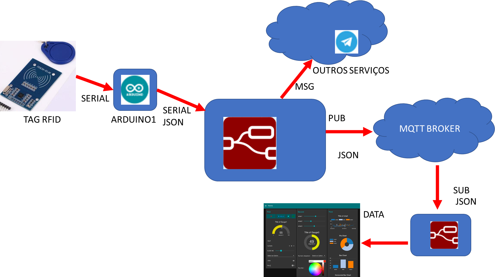
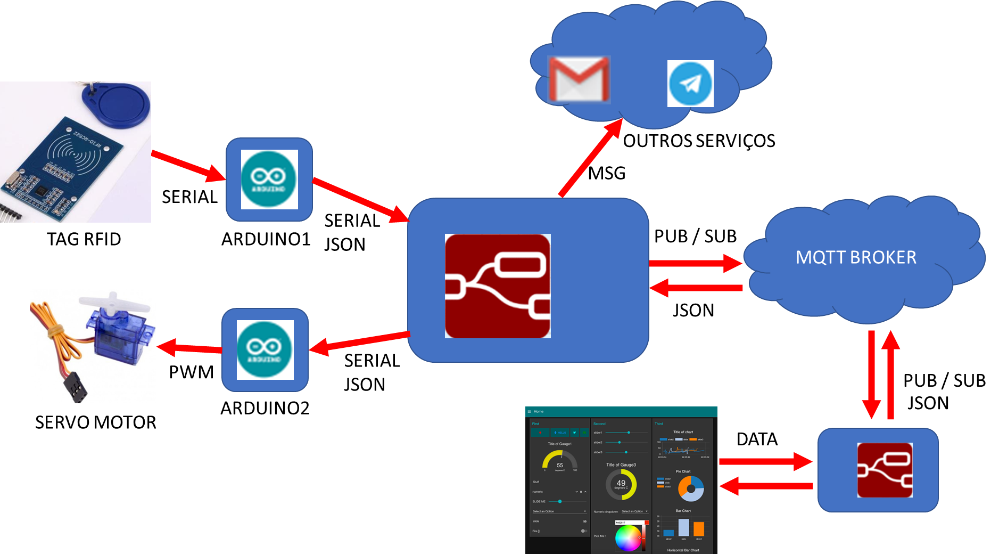
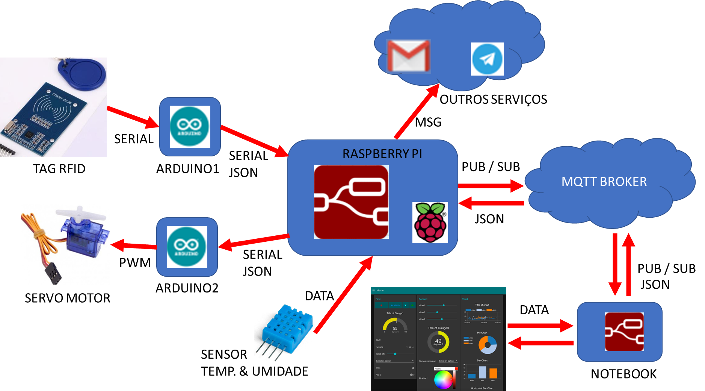

# CHECKPOINT4

- O objetivo do checkpoint é avaliar sua compreensão acerca do conteúdo ministrado pela disciplina. 

## FORUMLÁRIO DE ENTREGA

FORMULÁRIO PARA ENTREGA DO PROJETO: O GRUPO DEVE PREENCHER: [https://forms.gle/8g6gi5LL3gyvh3sX9](https://forms.gle/8g6gi5LL3gyvh3sX9)

## Ideia geral

Neste checkpoint vocês irão desenvolver o protótipo de um sistema de identificação IoT, que em linhas gerais irá possuir as seguintes interfaces:

## Rubrica

***(R1 - NOTA 6)*** Requisitos funcionais minimos do sistema deve seguir a imagem abaixo:

Para atender esta rubrica, o sistema deve ser capaz de coletar a identificação da TAG RFID com o Arduino (ARDUINO1) e envia utilizando formato JSON para um fluxo Node-Red que realiza duas funções: - publica em um tópico utilizando o protocolo MQTT ; - Notifica o usuário via telegram. Um segundo fluxo Node-Red subscreve o tópico e exibe o valor da TAG em um DASHBOARD.

***(R2 - NOTA 7)*** Requisitos funcionais minimos do sistema deve seguir a imagem abaixo:

Para atender esta rubrica, implementa a rubrica R1 e o sistema se comunica com o arduino (ARDUINO2) no formato JSON para realizar o sistema de posição do servo motor. O usuário recebe a push do sistema pelo telegram e via email. A posição do servo motor é controlado pelo DASHBOARD.

***(R3 - NOTA 8)*** Requisitos funcionais minimos do sistema deve seguir a imagem abaixo:

Para atender esta rubrica, implementa a rubrica R2 e o sistema do servidor node-Red deve estar embarcado na Raspberry PI e ser capaz de coletar a cada 30s dados do sensor DTH11 (Temperatura e Umidade). As informações do sensor são sempre exibidas no Dashboard, e enviadas para o usuário apenas se a umidade estiver abaixo de 50% ou a temperatura estiver acima de 30°C.

***(R4 - NOTA 10)*** Requisitos funcionais minimos do sistema deve seguir a imagem abaixo:

Para atender esta rubrica, implementa a rubrica R3 e integração com algum banco de dados e implementação mobile (o grupo define a linguagem de programação). 

## Entrega e Apresentação do projeto:

- Projeto pode ser realizado em no máximo 2 alunos (DUPLAS).
- Entrega via github, apresentar o repositório ORGANIZADO do projeto com toda a doumento e instruções. 
- Gravar um video curto demonstrando o funcionamento de acordo com a rubrica.

